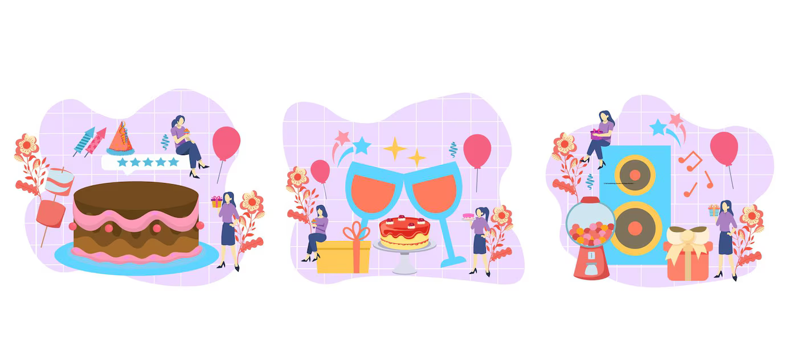

# s21_SimpleKat1ch

## Contents

0. **[Preamble](#Preamble)**  
1. **[Chapter I. Введение](#Chapter-I)**  
2. **[Chapter II. Порядок действий](#Chapter-II)**  
3. **[Chapter III. Поздравления](#Chapter-III)**  

---

### Preamble

Осень 2023 года, Казань. Мы все собрались в Школе 21, а первый проект объединил нас и дал начало нашим дружеским кодам и тёплым разговорам. С тех пор многое изменилось: ты теперь живёшь в Москве с мужем, а мы остались в Казани. Но дружба, как и хорошие программы, не имеет границ. В честь твоего дня рождения мы подготовили этот сюрприз в стиле первого школьного задания — так, чтобы ты вспомнила этот незабываемый старт.

---

### Chapter I. Введение

Наш проект посвящён поздравлениям для тебя и организован по всем канонам Школы 21.

---

### Chapter II. Порядок действий

**Отсканируй код**  
Сканируй код, чтобы перейти в Telegram-канал, где тебя ждет наш  сюрприз!

**Подпишись на Telegram-канал**  
Это очень важный пункт. Только с момента твоей подписки начинается шоу!

---

### Chapter III. Поздравления

С помощью QR-кода мы собрали все добрые слова и пожелания в одном месте — так же, как собирали первый проект, помнишь?
Каждое сообщение в канале — напоминание о днях, когда мы вместе делали первые шаги в программировании и поддерживали друг друга. Мы рады, что у нас есть такие воспоминания, и хотим, чтобы ты знала: твои друзья всегда рядом, пусть и через экран.

---

С днём рождения, Катюшкинс! 🎉